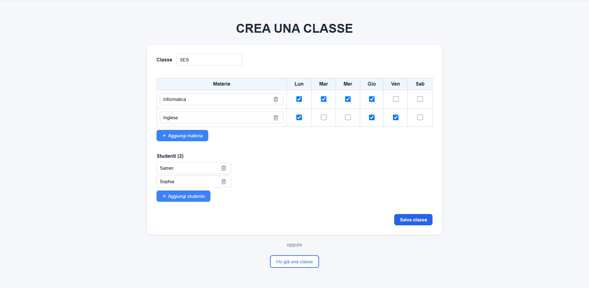
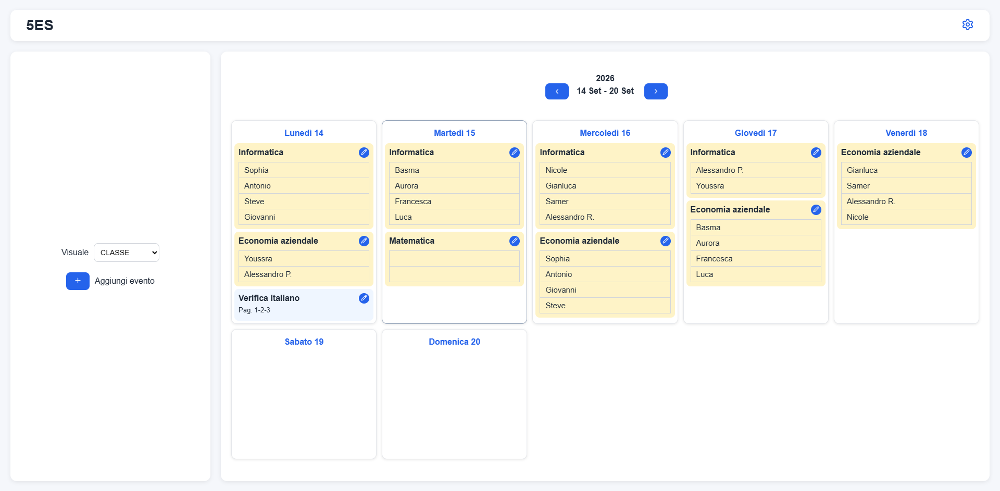
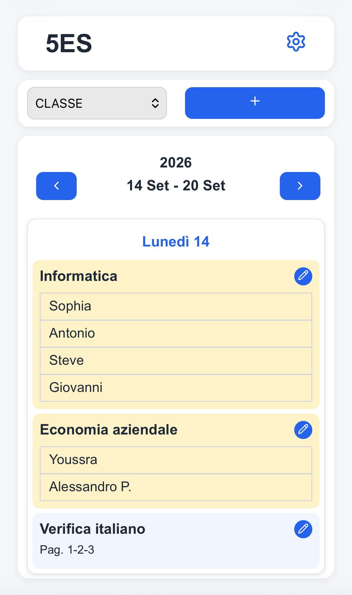

# Class Planner

Class Planner è una web app per la gestione e l'organizzazione delle interrogazioni e degli impegni scolastici di una classe.

L'applicazione permette di creare una classe, configurarne studenti, materie e orario settimanale e utilizzare queste informazioni per pianificare interrogazioni ed eventi attraverso un calendario condiviso.

## Descrizione

Class Planner nasce dall'esigenza di sostituire i tradizionali fogli condivisi utilizzati dagli studenti per organizzare interrogazioni e impegni scolastici.

Ogni classe dispone di un codice condivisibile che permette di accedere rapidamente al proprio calendario.

L'orario settimanale delle materie viene utilizzato per determinare automaticamente le date disponibili per le interrogazioni. Per ogni data è possibile definire il numero di posti disponibili, consentendo poi agli studenti di prenotarsi.

Class Planner include inoltre un sistema di distribuzione automatica che assegna gli studenti agli slot disponibili cercando di distribuire le interrogazioni nel tempo.

L'obiettivo del progetto è offrire uno strumento semplice, veloce e accessibile anche da smartphone per coordinare la pianificazione di una classe.

## Screenshot

### Creazione della classe

Durante la creazione è possibile inserire studenti e materie e definire i giorni della settimana associati a ciascuna materia.



### Calendario della classe

Visualizzazione settimanale delle interrogazioni e degli eventi della classe.



### Interfaccia mobile

L'interfaccia responsive permette di consultare e gestire il calendario anche da smartphone.

<p align="center">
    
</p>

---

## Funzionalità

### Gestione della classe

- Creazione di una nuova classe.
- Generazione di un codice condivisibile per l'accesso.
- Accesso rapido tramite codice classe.
- Memorizzazione dell'ultima classe utilizzata nel browser.
- Modifica di studenti, materie e orario.
- Eliminazione della classe e dei relativi dati.

### Materie e orario

- Inserimento delle materie della classe.
- Associazione di ogni materia ai giorni della settimana in cui è presente.
- Utilizzo dell'orario per determinare le date valide delle interrogazioni.

### Calendario

- Visualizzazione settimanale degli impegni.
- Navigazione tra settimane.
- Visualizzazione separata per classe o singolo studente.
- Visualizzazione di interrogazioni ed eventi.
- Interfaccia responsive ottimizzata per desktop e smartphone.

### Interrogazioni

- Creazione degli slot di interrogazione.
- Generazione delle date disponibili in base all'orario della materia.
- Definizione della capacità di ogni slot.
- Prenotazione e rimozione degli studenti.
- Modifica ed eliminazione degli slot.
- Distribuzione automatica degli studenti tra gli slot disponibili.

### Eventi

- Creazione di eventi della classe.
- Definizione di nome, descrizione e periodo dell'evento.
- Modifica ed eliminazione degli eventi.
- Visualizzazione degli eventi direttamente nel calendario.

---

## Distribuzione automatica

Una delle funzionalità principali di Class Planner è la possibilità di distribuire automaticamente gli studenti negli slot di una nuova interrogazione.

L'algoritmo tiene conto delle altre interrogazioni già assegnate agli studenti e cerca di favorire una distribuzione più equilibrata nel tempo, rispettando contemporaneamente la capacità massima definita per ogni slot.

In questo modo è possibile creare rapidamente un piano iniziale senza dover assegnare manualmente ogni studente.

---

## Tecnologie utilizzate

- HTML
- CSS
- JavaScript
- PHP
- MySQL

Il progetto è sviluppato senza framework, utilizzando direttamente le tecnologie web principali sia per il frontend sia per il backend.

---

## Struttura del progetto

```text
Class-Planner/
├── config/
│   ├── database.php
│   └── database.local.php
│
├── public/
│   ├── index.html
│   ├── create_class.html
│   ├── class_planner.php
│   ├── css/
│   │   ├── common.css
│   │   ├── index.css
│   │   ├── create_class.css
│   │   └── class_planner.css
│   ├── js/
│   │   ├── create_class.js
│   │   └── class_planner.js
│   ├── php/
│   │   ├── class_data.php
│   │   ├── events.php
│   │   ├── oral.php
│   │   └── delete_class.php
│   └── assets/
│       ├── logo.png
│       └── favicon.png
│
├── screenshots/
│   ├── create-class.png
│   ├── calendar-desktop.png
│   └── calendar-mobile.jpeg
│
├── sql/
│   └── schema.sql
│
├── .gitignore
└── README.md
```

`public/` contiene i file accessibili dal web, mentre la configurazione del database è mantenuta separata dalla document root.

Il file `database.local.php`, contenente le credenziali dell'ambiente locale o di produzione, non viene incluso nel repository.

---

## Installazione locale

### Requisiti

È necessario disporre di:

- Apache o un altro web server compatibile con PHP
- PHP
- MySQL

Per lo sviluppo locale è possibile utilizzare, ad esempio, XAMPP.

### 1. Clonare il repository

```bash
git clone https://github.com/lucaandreicarp/Class-Planner.git
```

### 2. Configurare il database

Creare un database MySQL e importare:

```text
sql/schema.sql
```

### 3. Configurare la connessione

Creare il file:

```text
config/database.local.php
```

con la configurazione del proprio database:

```php
<?php

return [
    'host' => 'localhost',
    'user' => 'your_username',
    'password' => 'your_password',
    'database' => 'class_planner'
];
```

Il file è escluso dal repository tramite `.gitignore` per evitare di pubblicare le credenziali del database.

### 4. Avviare l'applicazione

Configurare il web server utilizzando `public/` come document root.

In alternativa, durante lo sviluppo locale è possibile posizionare il progetto nella directory del proprio server web e accedere alla cartella `public`.

---

## Utilizzo

1. Creare una nuova classe.
2. Inserire le materie e specificare i relativi giorni della settimana.
3. Inserire gli studenti.
4. Condividere il codice generato con la classe.
5. Creare interrogazioni o eventi dal calendario.
6. Prenotare manualmente gli studenti oppure utilizzare la distribuzione automatica.
7. Consultare il calendario della classe o quello di un singolo studente.

---

## Versione online

Class Planner è disponibile online:

**https://classplanner.it**

---

## Sviluppi futuri

Possibili evoluzioni del progetto:

- Sistema di account e autenticazione.
- Gestione di ruoli e permessi.
- Miglioramento della sicurezza delle operazioni amministrative.
- Statistiche sull'organizzazione delle interrogazioni.

---

## Autore

**Luca-Andrei Carp**

Progetto sviluppato come applicazione web personale e portfolio project.